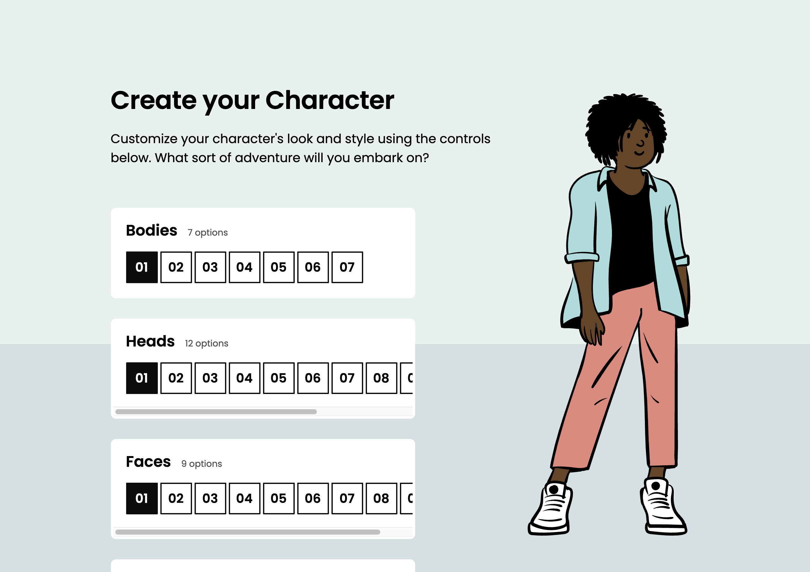
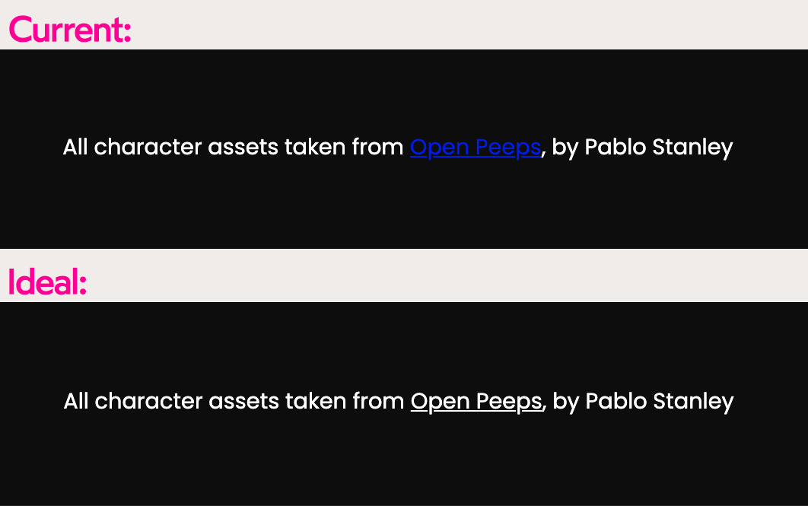
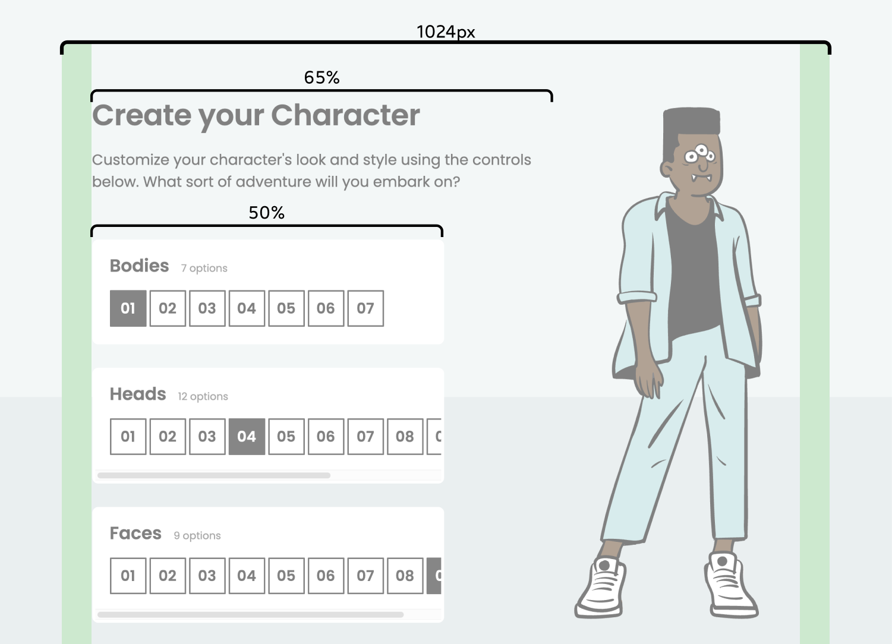
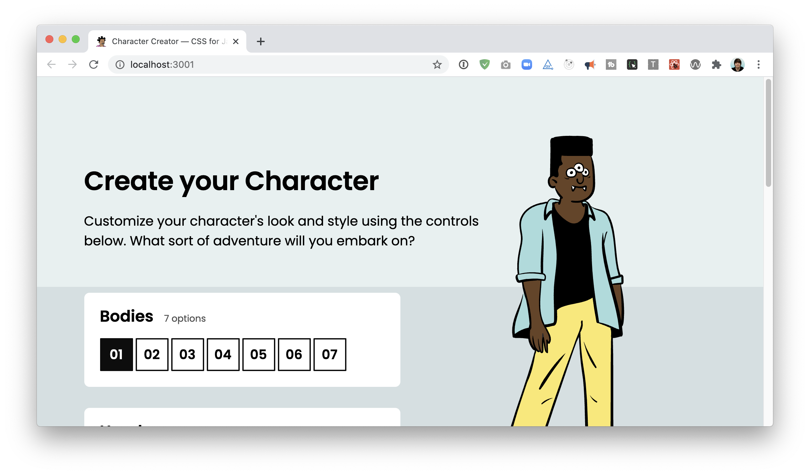
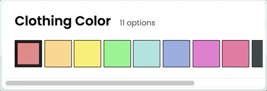
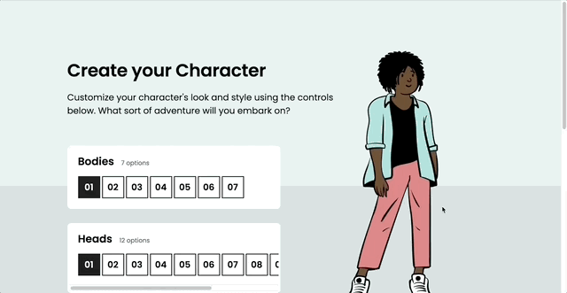
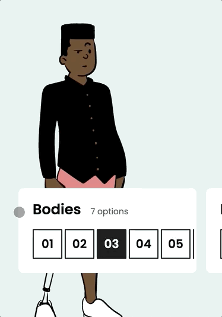

# Character Creation Workshop

In this workshop, you'll build a Sims-style character creation screen.

## Mockups

Desktop:



For this workshop, we're only targeting desktops (although if you're so inclined, creating a mobile variant would make a great stretch goal!).

> Protip: If you're reading this in VS Code, open the Command Palette (Cmd + Shift + P) and select “Markdown: Open Preview to the Side”. That way, you can see all the images in this document!

## Setup Instructions

This project uses create-react-app.

Start by installing dependencies:

```
npm install
```

Boot up a dev server:

```
npm run start
```

You should be able to access the application at `http://localhost:3000`.

## Troubleshooting

If you run into problems running a local development server, check out our [Troubleshooting Guide](https://courses.joshwcomeau.com/troubleshooting) on the course platform.

This guide addresses the common `Digital Envelope Routine` error you may have seen.

## Project structure and context

This project is built with React.

**All of the functionality has already been built.** Your job is to add the CSS. You're also allowed to tweak the JSX (HTML) as-needed. But you shouldn't need to fuss with any advanced React stuff.

This project uses **CSS Modules**. CSS modules are ultimately very similar to vanilla CSS, but the classes are applied in JS. Here's an example:

```css
/* Something.module.css */
.wrapper {
  width: 500px;
}
```

```js
/* Something.js */
import styles from './Something.module.css';

function Something() {
  return (
    <div className={styles.wrapper}>
      I'll be 500px wide!
    </div>
  );
}
```

Additionally, a few global styles can be found in `src/index.css`.

## Exercises

### Exercise 1: Fix footer links

Let's start with a small detail: The footer links are unreadable:



### Exercise 2: Layout adjustments

Next, let's tackle the biggest visual issue: the layout.

We have a `MaxWidthWrapper` constraining the max width, but everything is super wide within it.

Our header should be 65% of the available width, and our control-panel column should be 50%.



The character (the big illustration) should use fixed positioning, and it should occupy the space cleared by the above width tweaks.

Give the character a minimum height of 500px. On smaller windows, this means the character won't fit in the viewport:



> NOTE: If you notice at some point that the character SVG disappears, it's likely because it needs to be given an explicit width/height. This is discussed in more depth on the “Solution” page, https://courses.joshwcomeau.com/css-for-js/02-rendering-logic-2/20-character-workshop-solution#collapsed-svgs

### Exercise 3: Overflow

Each control panel features a number of customizations. For control panels with too many options, a horizontal scrollbar should be introduced:



### Exercise 4: Perspective decoration

To help add a bit of perspective, a light gray bar should extend across the bottom 40% of the screen:


It should sit behind the avatar (and both the perspective bar and the character should sit below the footer):



You can use the background color `hsl(195deg, 20%, 86%)`.

For bonus points, solve this challenge without setting any z-indexes.

### Exercise 5 (Stretch): Implement a mobile variant

On mobile devices, the cards should stack horizontally, and sit near the bottom of the screen, underneath the character:



**NOTE:** This is a challenging stretch goal! It may require some CSS features we haven't covered yet. This is meant as an extra challenge for advanced students. Feel free to skip it!

## Submissions

**Workshops are submitted through the course platform.** Commit your changes, push them to your fork, and submit the link by clicking the "Complete lesson" button on the workshop page.

If you're not comfortable with Git, you can upload a `.zip` file using Dropbox or Google Drive, and paste a link to the public file instead.
